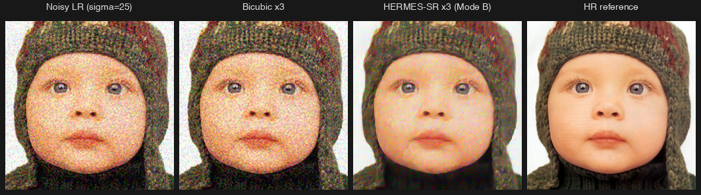

# HERMES-SR — research MVP

Y-channel mobile super-resolution. ~85K params, six-block trunk with reparameterizable depthwise large-kernel branches, a learning-free diamond-search flow estimator warping a 16-channel recurrent state, PixelShuffle head on a bicubic anchor. Mode A: single-image ×2. Mode B: noise-aware ×3.



Mode B on Set5 `baby` at σ=25: RGB-PSNR **22.22 dB** vs bicubic **21.70 dB** (+0.52 dB). Left-to-right: noisy LR input, bicubic ×3, model ×3, HR reference.

**Status:** MVP verification done on M1 Pro MPS at 20K iters (4 of 5 criteria met). See [RESULTS.md](RESULTS.md). CUDA convergence run pending. Design doc separate.

## Install + test

```bash
pip install -e .
pytest hermes_sr/tests/
```

## MVP train (MPS / CPU)

```bash
python -m hermes_sr.train --config configs/mode_a.json
python -m hermes_sr.train --config configs/mode_b.json
```

Datasets under `~/datasets`. On Apple Silicon set `PYTORCH_ENABLE_MPS_FALLBACK=1`.

## CUDA convergence run

GPU server with PyTorch + CUDA already set up:

```bash
./run_mode_a_train.sh   # 200K iters, ~75 min on RTX 4090
./run_mode_b_train.sh   # 100K iters, warm-starts from Mode A
```

Datasets auto-download to `~/datasets/`. Deploy checkpoints land at `checkpoints/hermes_*_deploy_convergence.pt`; full results at `results/`.

## Deploy

```bash
python -m hermes_sr.scripts.reparameterize \
  --in checkpoints/<training>.pt --out checkpoints/<deploy>.pt
```
