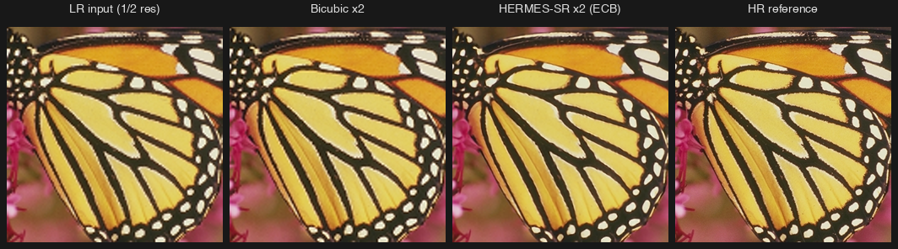

# HERMES-SR — research MVP

Y-channel mobile super-resolution. ~57K inference params, reparameterizable Edge-oriented Convolution Blocks (ECB) that collapse to a dense 3×3 at deploy (NPU-optimal), PixelShuffle head on a bilinear anchor. Mode A: clean ×2. Mode B: noise-aware ×3.



Mode A `butterfly` ×2 (ECB): RGB-PSNR **30.75** vs bicubic **26.99 dB** (+3.76). L→R: LR / bicubic / model / HR.

**Status:** ECB Mode A = **35.07 dB / 0.968 SSIM** on Set5 ×2 at 20K iters MPS (bicubic 33.11). Mode B ECB retraining. See [RESULTS.md](RESULTS.md). CUDA convergence scripts ready.

## Install + test

```bash
pip install -e .
pytest hermes_sr/tests/
```

## Train (MPS / CPU)

```bash
python -m hermes_sr.train --config configs/mode_a.json
python -m hermes_sr.train --config configs/mode_b.json
```

Datasets under `~/datasets`. On Apple Silicon set `PYTORCH_ENABLE_MPS_FALLBACK=1`.

## CUDA convergence run

```bash
./run_mode_a_train.sh   # 600K iters, ~3.75 hr on RTX 4090
./run_mode_b_train.sh   # 300K iters, warm-starts from Mode A
```

Auto-downloads to `~/datasets/`. Deploy ckpts at `checkpoints/hermes_*_deploy_convergence.pt`.

## Deploy

```bash
python -m hermes_sr.scripts.reparameterize \
  --in checkpoints/<training>.pt --out checkpoints/<deploy>.pt
```
